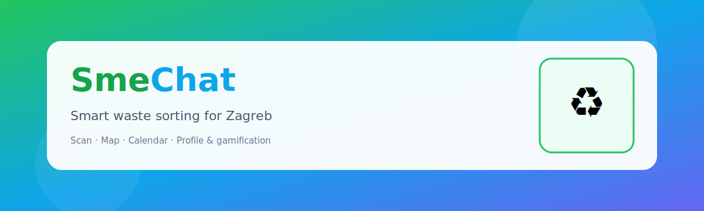
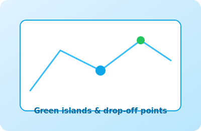
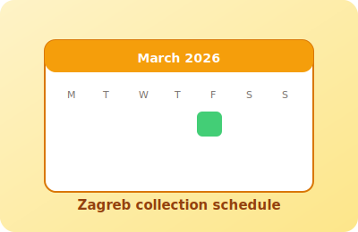

<p align="center">
  
</p>

<p align="center">
  
  
  
  
  
</p>

# SmeChat

**SmeChat** is a mobile-first web app for **household waste sorting**, focused on **Zagreb** (bin colours, collection calendar, useful locations). Users take a photo of waste, get a **category suggestion** powered by **Google Cloud Vision** (label detection mapped to local bin categories), learn where to dispose of it, and earn **points, badges, and per-type stats** — backed by **Supabase** authentication and profile data.

> Visual design started from the [Snap&amp;Sort Figma bundle](https://www.figma.com/design/WNyvu6PY8MPDS9oPJ0V7jg/Snap-Sort-App-Design); the shipped product is **SmeChat**.

---

## Gallery

| Scan &amp; AI | Map | Calendar | Profile |
|:---:|:---:|:---:|:---:|
|  |  |  |  |

Add real screenshots under `docs/screenshots/` (e.g. `scan.png`, `map.png`) and point the table `src` attributes to those files if you want photos in the README.

---

## Features

- **Photo scan** — **Google Cloud Vision API** (`LABEL_DETECTION`); returned labels are mapped to app categories (paper, plastic, glass, bio, batteries, textile). Without a key, the app falls back to a simulated category for local testing.
- **Result screen** — guidance aligned with **Zagreb-style** bins (including mixed / residual where relevant in copy).
- **Interactive map** — **Leaflet** with **OpenStreetMap** tiles; green islands and related POIs.
- **Collection calendar** — Zagreb-oriented schedule, links to official sources, optional **Razvrstaj MojZG** address lookup.
- **Profile &amp; gamification** — points per type, streaks, badges; Supabase stores aggregates and `waste_by_type` after scans.
- **ECO assistant** — optional **Google Gemini** chat for recycling questions.
- **i18n** — Croatian and English UI strings.

---

## Tech stack

| Layer | Choice |
|--------|--------|
| UI | React 18, Tailwind CSS 4, Radix UI, Motion, Lucide |
| Routing | React Router 7 |
| Backend / auth | Supabase (Auth, Postgres, RLS, RPC) |
| Vision scan | Google Cloud Vision API |
| Chat | Google Generative AI (Gemini) |
| Map | Leaflet, react-leaflet, OpenStreetMap |

---

## Quick start

```bash
git clone <repo-url>
cd CurosorHakaton1
npm install
cp .env.example .env
# Edit .env — Supabase URL and anon key are required for auth/stats
npm run dev
```

App runs at `http://localhost:5173` (default Vite port).

### Production build

```bash
npm run build
```

Output is in `dist/`.

### Other scripts

- **`npm run build:zeleni`** — helper to build GeoJSON for green islands (if used in your workflow).

---

## Environment (`.env`)

Copy `.env.example` to `.env` (`.env` is gitignored).

| Variable | Required | Description |
|----------|----------|-------------|
| `VITE_SUPABASE_URL` | yes | Supabase project URL |
| `VITE_SUPABASE_ANON_KEY` | yes | Supabase anon (public) key |
| `VITE_GOOGLE_VISION_API_KEY` | no | Enables real scan classification via Vision API |
| `VITE_GEMINI_API_KEY` | no | ECO assistant chat |
| `VITE_GEMINI_MODEL` | no | Optional Gemini model override |
| `VITE_GOOGLE_MAPS_API_KEY` | no | Reserved; the map uses OpenStreetMap tiles only |

**Note:** `VITE_*` values are embedded in the client bundle. For production, prefer a small backend proxy for API keys instead of exposing them in the browser.

Enable **Cloud Vision API** in Google Cloud Console for the project tied to `VITE_GOOGLE_VISION_API_KEY`.

---

## Database (Supabase)

Migrations live in `supabase/migrations/` (users table, signup trigger, `record_user_scan` RPC with points, streak, `waste_by_type`, etc.).

```bash
supabase db push
```

---

## Routes

| Path | Screen |
|------|--------|
| `/login` | Login |
| `/` | Scan |
| `/map` | Map |
| `/calendar` | Calendar |
| `/profile` | Profile |
| `/result/:category` | Result after classification |

---

## Team

<p align="center">
  <strong>Josip Bušelić</strong> · <strong>Roko Matek</strong> · <strong>Jurica Šlibar</strong> · <strong>Fran Kramberger</strong>
</p>

<p align="center"><em>Hackathon / team project — thanks to everyone who contributed.</em></p>

---

## License

Private repository (`private` in `package.json`). Add a license if you open-source the project.
